# Marketplace Platform

This is a service marketplace platform built with Laravel, allowing service providers to create listings, customers to find and contact them, and administrators to moderate the content.

## Core Technologies

-   **Backend:** Laravel 11
-   **Frontend:** Blade, Tailwind CSS
-   **Database:** MySQL
-   **Authentication:** Laravel Sanctum (for API), Laravel Breeze (for web)
-   **Roles & Permissions:** `spatie/laravel-permission`

---

## 1. Installation and Setup

Follow these steps to get the application running on your local machine.

### Prerequisites

-   PHP >= 8.2
-   Composer
-   Node.js & NPM
-   A local database server (e.g., MySQL)

### Step-by-Step Guide

1.  **Clone the Repository**
    ```bash
    git clone <your-repository-url>
    cd marketplace
    ```

2.  **Install Dependencies**
    Install both PHP and JavaScript dependencies.
    ```bash
    composer install
    npm install
    ```

3.  **Environment Configuration**
    Create your environment file and generate an application key.
    ```bash
    cp .env.example .env
    php artisan key:generate
    ```

4.  **Configure Database**
    Open the `.env` file and update the database connection details to match your local setup.
    ```dotenv
    DB_CONNECTION=mysql
    DB_HOST=127.0.0.1
    DB_PORT=3306
    DB_DATABASE=marketplace
    DB_USERNAME=root
    DB_PASSWORD=
    ```

5.  **Run Migrations and Seed the Database**
    This command will create all necessary tables and populate the database with test users, roles, categories, and listings, so you can start testing immediately.
    ```bash
    php artisan migrate --seed
    ```

6.  **Start the Servers**
    Run the Vite development server for frontend assets and the Laravel development server.
    ```bash
    # Terminal 1: Start Vite
    npm run dev

    # Terminal 2: Start Laravel
    php artisan serve
    ```

The application will be available at **http://127.0.0.1:8000**.

---

## 2. User Roles & Test Credentials

The database seeder creates the following users. You can use them to test the different roles and workflows.

| Role       | Email                | Password   |
| :--------- | :------------------- | :--------- |
| **Admin**  | `admin@test.com`     | `password` |
| **Provider** | `provider@test.com`  | `password` |
| **Customer** | `customer@test.com`  | `password` |

---

## 3. Application Workflow & Features

### Provider Workflow

1.  **Login:** If a "provider" logs in, they can see the dashboard..
2.  **Dashboard:** The provider dashboard (`/provider/dashboard`) shows key statistics like total listings, pending listings, and open enquiries.
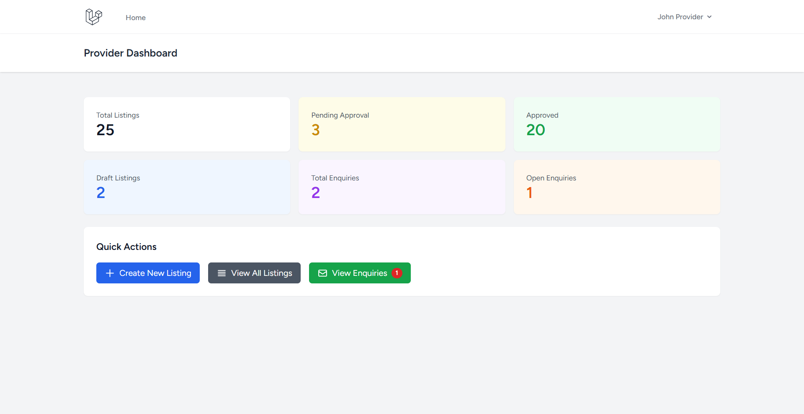
3.  **Create & Manage Listings:**
    -   Providers can create new listings from their dashboard.
    -   They can save a listing as a **draft** or submit it for **pending** approval.
    -   Existing listings can be edited or deleted.
    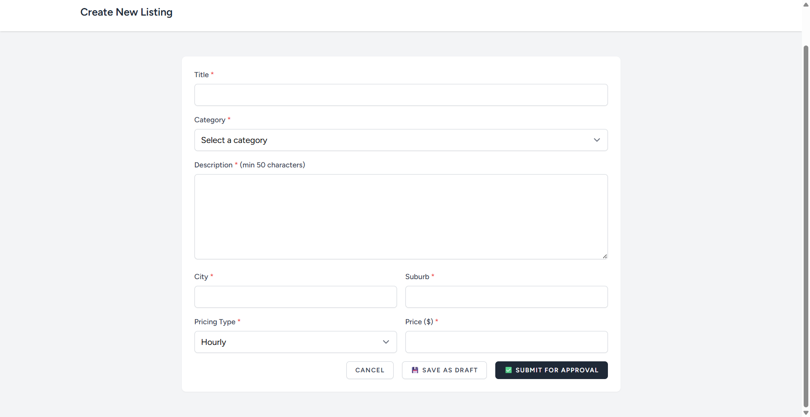
    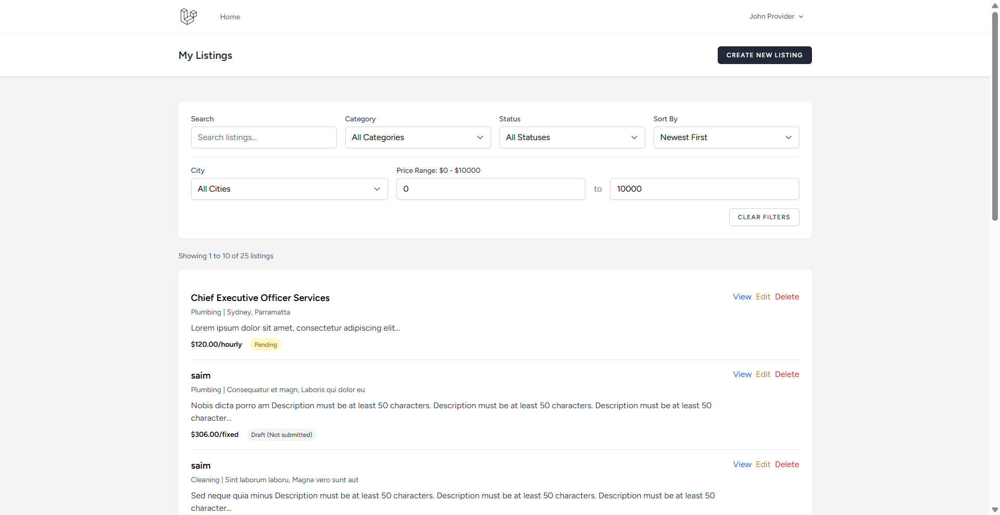
    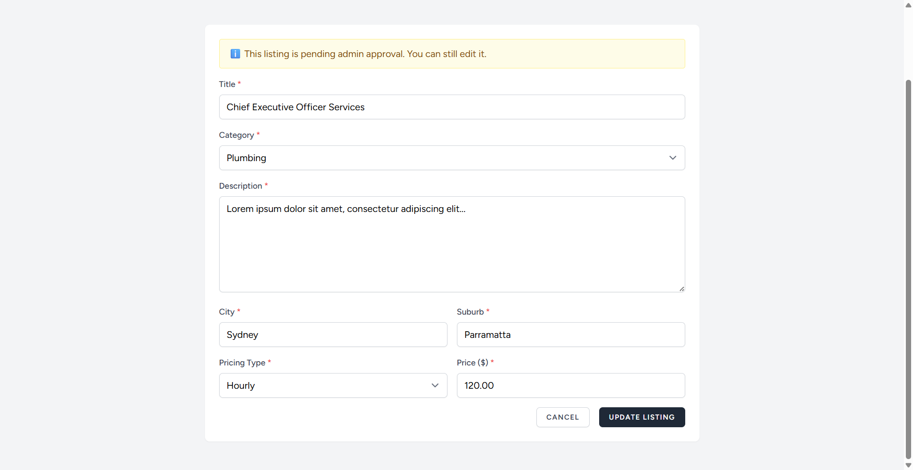

4.  **Manage Enquiries:**
    -   Providers can view all enquiries received from customers at `/provider/enquiries`.
    -   They can open an enquiry to view the full conversation and send a **reply**.
    -   Once a conversation is complete, they can **close** the enquiry.
     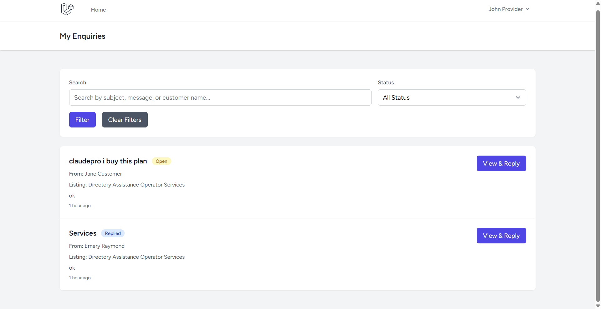
     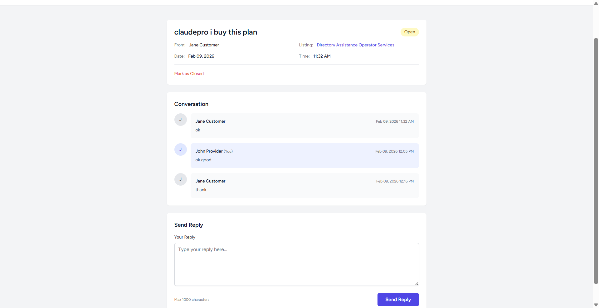

### Admin Workflow

1.  **Login:** The admin logs in with the credentials above.
2.  **Dashboard:** The admin dashboard (`/admin/dashboard`) provides an overview of the entire platform, including total listings and counts for each status (pending, approved, suspended).
3.  **Moderate Listings:**
    -   Admins can view all listings submitted by providers.
    -   They have the authority to **approve** a pending listing, making it public.
    -   They can also **suspend** an approved listing if it violates platform rules.

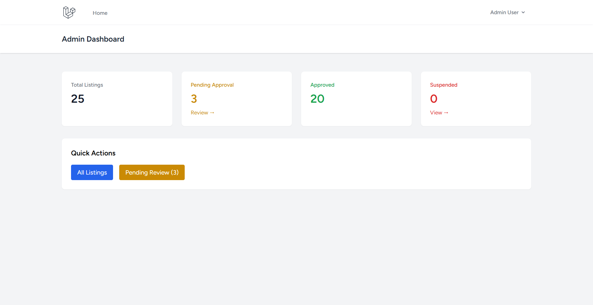
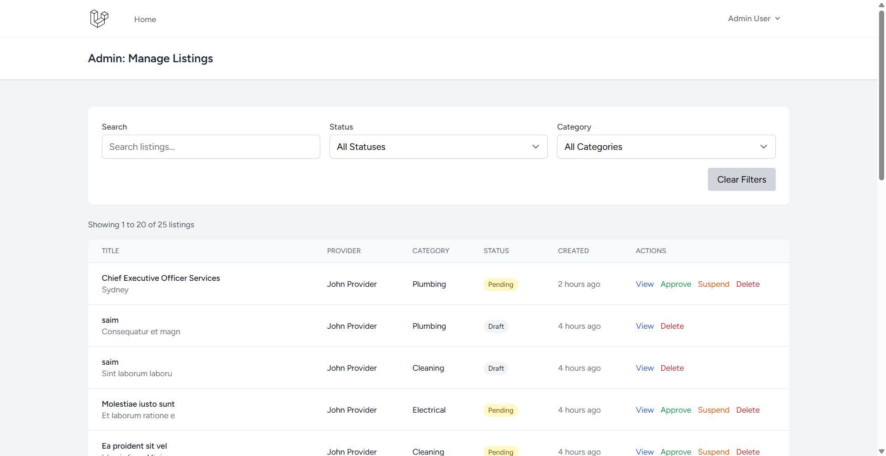

### Customer Workflow

1.  **Register/Login:** A user can register and will be assigned the "Customer" role.
2.  **Browse Listings:** Customers can browse all approved listings on the public-facing pages.
3.  **Send Enquiries:**
    -   From a listing's detail page, a customer can fill out a form to send an enquiry directly to the provider.
4.  **Manage Enquiries:**
    -   Customers have their own dashboard (`/dashboard`) and an enquiry management page (`/my-enquiries`).
    -   They can view the status of their sent enquiries and read **replies** from providers.
    -   They can continue the conversation by replying back to the provider.
    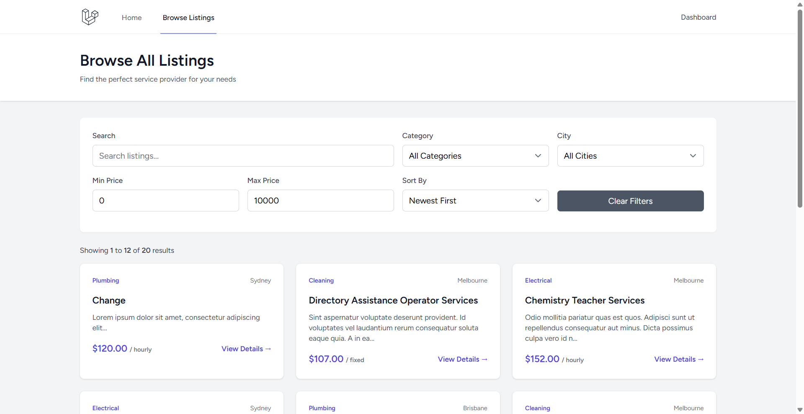
    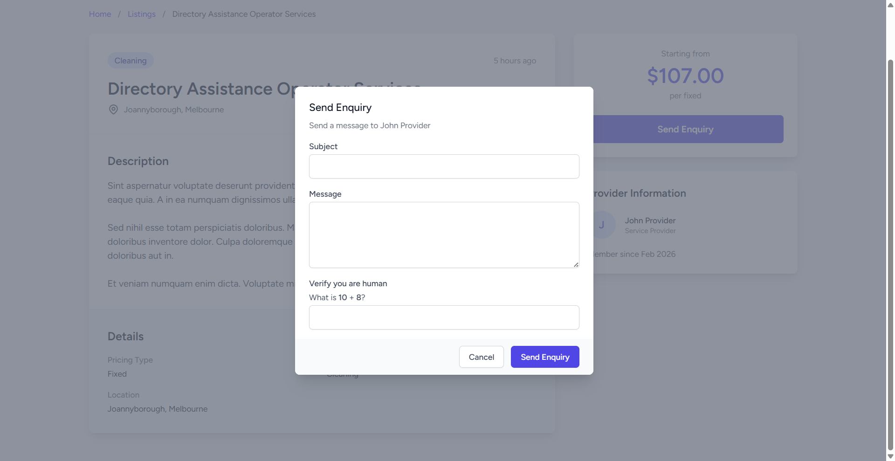
    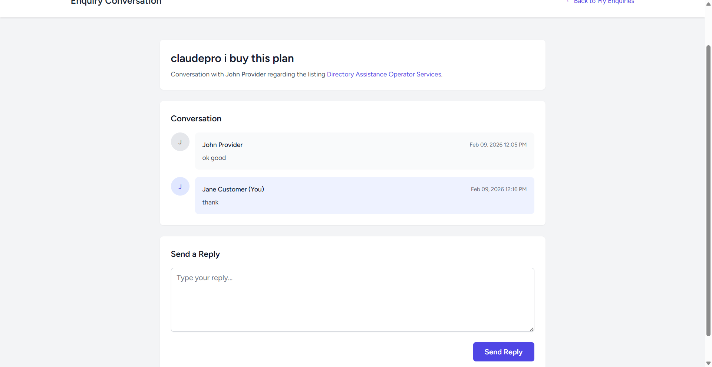


---

## 4. API Endpoints (`routes/api.php`)

The application also exposes a RESTful API for listings and authentication.

**Base URL:** `http://127.0.0.1:8000/api`

### Public Endpoints

| Method | URI                  | Action                               |
| :----- | :------------------- | :----------------------------------- |
| `GET`  | `/listings`          | Get a paginated list of all listings |
| `GET`  | `/listings/{listing}`| Get details for a single listing     |
| `POST` | `/register`          | Register a new user                  |
| `POST` | `/login`             | Authenticate a user and get a token  |

### Protected Endpoints (Requires Sanctum Token)

These routes require an `Authorization: Bearer <token>` header.

| Method   | URI                    | Role(s)  | Action                               |
| :------- | :--------------------- | :------- | :----------------------------------- |
| `GET`    | `/user`                | All      | Get the authenticated user's details |
| `POST`   | `/logout`              | All      | Log out the current session          |
| `POST`   | `/logout-all`          | All      | Log out from all devices             |
| `POST`   | `/listings`            | Provider | Create a new listing                 |
| `PUT`    | `/listings/{listing}`  | Provider | Update an existing listing           |
| `DELETE` | `/listings/{listing}`  | Provider | Delete a listing                     |
| `GET`    | `/my-listings`         | Provider | Get listings for the auth'd provider |